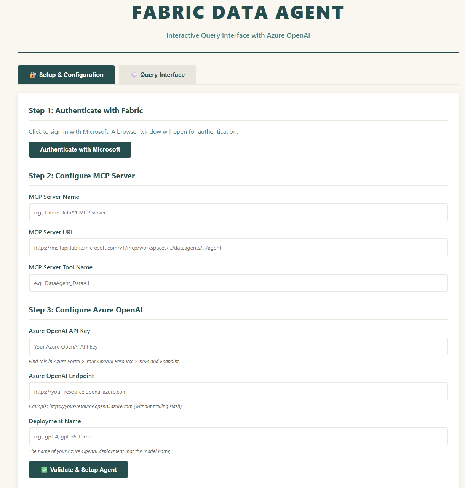

# Fabric Data Agent - Web Interface (Azure OpenAI)

A web application for querying Microsoft Fabric Data Agent using MCP (Model Context Protocol) with Azure OpenAI orchestration.

## Overview

This Flask-based web application provides an interactive interface for querying Fabric Data Agents. It uses MSAL for Microsoft authentication, connects to Fabric Data Agents via MCP protocol, and leverages Azure OpenAI for AI orchestration.

## Features

- MSAL interactive authentication for secure Microsoft login
- MCP protocol integration for Fabric Data Agent communication
- Azure OpenAI integration for AI orchestration
- Conversational interface with chat history
- Server-side session management
- Clean, responsive web UI

## Prerequisites

- Python 3.11 or higher
- Microsoft Fabric workspace with a Data Agent
- Azure OpenAI resource with an active deployment
- Microsoft account with Fabric workspace access

## Dependencies

```
flask>=3.0.0
msal>=1.24.0
httpx>=0.27.0
pydantic-ai>=1.39.0
openai>=1.0.0
```

## Installation

1. Clone or download the project to your local machine

2. Navigate to the project directory:
```bash
cd fabric-data-agent-aoai
```

3. Install required dependencies:
```bash
pip install -r requirements.txt
```

## Configuration

### Azure OpenAI Setup

You will need the following from your Azure OpenAI resource:

1. **API Key**
   - Location: Azure Portal > Your OpenAI Resource > Keys and Endpoint
   - Copy either KEY 1 or KEY 2

2. **Endpoint URL**
   - Location: Azure Portal > Your OpenAI Resource > Keys and Endpoint
   - Format: `https://your-resource.openai.azure.com`
   - Note: Do not include a trailing slash

3. **Deployment Name**
   - Location: Azure OpenAI Studio > Deployments
   - Use your custom deployment name (e.g., `gpt-4`, `gpt-4o`, `gpt-35-turbo`)
   - This is the deployment name, not the base model name

### Fabric Data Agent Setup

You will need the following from your Fabric workspace:

1. **MCP Server URL**
   - Format: `https://api.fabric.microsoft.com/v1/mcp/workspaces/{workspace-id}/dataagents/{agent-id}/agent`
   - Obtain from your Data Agent settings in Fabric, see details [here](https://learn.microsoft.com/en-us/fabric/data-science/data-agent-mcp-server)

2. **Tool Name**
   - Found in your Data Agent configuration
   - Describe the tool in settings, including the publishing description

## Usage

### Starting the Application

Run the Flask application:
```bash
python app.py
```

The application will start on `http://127.0.0.1:5000`

### Configuration Steps



1. **Open the Web Interface**
   - Navigate to `http://127.0.0.1:5000` in your web browser

2. **Step 1: Authenticate with Microsoft**
   - Click "Authenticate with Microsoft"
   - A browser window will open for Microsoft login
   - Sign in with your Microsoft account
   - Wait for "Authentication successful!" message

3. **Step 2: Configure MCP Server**
   - Enter MCP Server Name (any descriptive name)
   - Enter MCP Server URL (from Fabric Data Agent settings)
   - Enter MCP Server Tool Name (from Fabric Data Agent configuration)

4. **Step 3: Configure Azure OpenAI**
   - Enter Azure OpenAI API Key
   - Enter Azure OpenAI Endpoint URL (without trailing slash)
   - Enter Deployment Name (your Azure OpenAI deployment)

5. **Validate Configuration**
   - Click "Validate & Setup Agent"
   - Wait for "Configuration validated! Ready to query." message

6. **Start Querying**
   - Switch to "Query Interface" tab
   - Enter questions about your data
   - View AI-orchestrated responses

## Project Structure

```
fabric-data-agent-aoai/
├── app.py                 # Main Flask application
├── templates/
│   └── index.html        # Web interface
├── requirements.txt      # Python dependencies
├── README.md            # Documentation
└── QUICKSTART.md        # Quick reference guide
```

## Technical Architecture

### Backend Components

- **Flask**: Web framework for handling HTTP requests and session management
- **MSAL**: Microsoft Authentication Library for Fabric authentication
- **pydantic-ai**: AI framework for agent orchestration
- **AsyncAzureOpenAI**: Azure OpenAI client for LLM interactions
- **httpx**: HTTP client for MCP protocol communication

### Frontend Components

- **HTML/CSS**: Clean, responsive user interface
- **Vanilla JavaScript**: Client-side interaction handling
- **Fetch API**: Asynchronous communication with backend

### Authentication Flow

1. User initiates authentication via web interface
2. Background thread starts MSAL interactive authentication
3. Browser window opens for Microsoft login
4. Token is stored in server-side session upon successful authentication
5. Token is used for subsequent MCP calls to Fabric

### Query Flow

1. User submits question via web interface
2. pydantic-ai agent receives the question
3. Agent uses Azure OpenAI for natural language understanding
4. Agent calls query_fabric_data_agent tool
5. Tool makes MCP JSON-RPC call to Fabric Data Agent
6. Results are processed and returned to user
7. Conversation history is maintained for context

## Azure OpenAI Configuration

The application uses the following Azure OpenAI settings:

- **Client**: AsyncAzureOpenAI (for asynchronous operations)
- **API Version**: 2024-02-15-preview
- **Model**: OpenAIChatModel from pydantic-ai
- **Provider**: Custom client override with Azure credentials

## Security Considerations

- All credentials are stored in server-side sessions only
- No credentials are logged or persisted to disk
- API keys are masked in the web interface
- Sessions expire when the browser is closed
- MSAL handles token management and refresh

## Troubleshooting

### Authentication Issues

**Problem**: Authentication fails or browser doesn't open

**Solutions**:
- Verify your Microsoft account has Fabric workspace access
- Ensure you're using a supported browser (Chrome, Edge, Firefox)
- Clear browser cache and cookies
- Check that your organization's security policies allow MSAL authentication

### MCP Connection Issues

**Problem**: Setup error or token validation fails

**Solutions**:
- Verify MCP Server URL is correct (copy directly from Fabric UI)
- Ensure Tool Name matches exactly (case-sensitive)
- Re-authenticate if token has expired
- Check network connectivity to Fabric endpoints

### Azure OpenAI Issues

**Problem**: Configuration validation fails

**Solutions**:
- Verify API key is correct and active
- Confirm endpoint URL has no trailing slash
- Check deployment name matches your Azure OpenAI deployment exactly
- Ensure deployment is active and not quota-limited
- Verify Azure subscription has available quota

### Query Failures

**Problem**: Queries timeout or return errors

**Solutions**:
- Verify Azure OpenAI deployment is active
- Check available quota in Azure Portal
- Ensure Data Agent is active in Fabric workspace
- Try simpler queries to isolate the issue
- Check application logs for detailed error messages

## Deployment

### Local Development

For local development, use the built-in Flask development server:
```bash
python app.py
```

### Production Deployment

For production environments, use a WSGI server:

1. Install Gunicorn:
```bash
pip install gunicorn
```

2. Run with Gunicorn:
```bash
gunicorn -w 4 -b 0.0.0.0:5000 app:app
```

3. Configure reverse proxy (nginx/Apache) with SSL
4. Implement proper firewall rules and access controls
5. Set up monitoring and logging

## API Endpoints

### POST /authenticate
Initiates MSAL interactive authentication

**Response**: Status message indicating authentication started

### GET /auth_status
Polls authentication status

**Response**: Current authentication status (pending/success/error)

### POST /validate_config
Validates and sets up agent configuration

**Request Body**:
```json
{
  "server_name": "string",
  "server_url": "string",
  "tool_name": "string",
  "api_key": "string",
  "azure_endpoint": "string",
  "deployment_name": "string"
}
```

**Response**: Configuration validation status

### POST /ask
Submits a question to the agent

**Request Body**:
```json
{
  "question": "string"
}
```

**Response**: Agent's answer to the question

### POST /clear
Clears conversation history

**Response**: Confirmation message

## Contributing

Contributions are welcome. Please follow these guidelines:

1. Fork the repository
2. Create a feature branch
3. Make your changes
4. Write or update tests as needed
5. Submit a pull request with a clear description

## License

MIT License - See LICENSE file for details

## Support

For issues or questions:
- Review this documentation
- Check the QUICKSTART.md guide
- Consult Microsoft Fabric documentation for Data Agent configuration
- Refer to Azure OpenAI documentation for deployment setup

## Version History

- v1.0.0 - Initial release with Azure OpenAI integration
- Migrated from OpenRouter to Azure OpenAI
- Uses AsyncAzureOpenAI client with pydantic-ai

