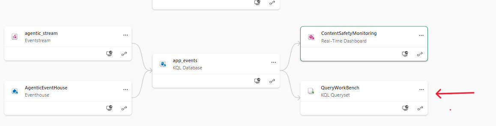

# Testing Real-time Alerting

During the app set up process, we already deployed all required Fabric artifacts, including the ones to enable streaming and storing real-time app usage logs. 

While almost all is in place, there are still a few steps remaining to fully set up the end to end process of streaming data and enabling the real-time dashboard for monitoring purposes. 

## Follow below steps to finalize real-time intelligence pipeline in Fabric

### Connect your Eventhouse database to the Eventstream

1. **Ensure you have done at least one test run with the application.** This enables the streaming pipeline to recognize and map the schema of incoming streaming data.
2. In your Fabric workspace, open your Eventstream artifact. 

    
3. Click on agentic_stream object, click on refresh and ensure there is at least one data entry:
    
As you can see in above image, EventHouse is shown as "Unconfigured". Click on "Configure", and follow steps as shown in below images:

    
    
    

4. After Clicking in "Close" in the last step, you willbe back at your EventStream pipeline view. Click on "Edit" on upper right side, then click on "Publish".

    
    

5. Now to test, run the app and perform a test chat. Then go back to your workspace and open the "app_events" KQL database (middle block). It may take a few minutes and do some refresh for the first time after publishing the changes to start seeing the event data in your database, but it should look like below:
    

6. Go back to your workspace view, and now open the "QueryWorkBench" block. We will be using the workbench to write queries for adding to the Real-Time Dashboard. As you can see there are already some example query blocks that you can choose and run. 
    
    

### Add content safety views to the Real-Time Dashboard

In this example exercise, we will be adding the queries to the existing "ContentSafetyMonitoring" dashboard. Below is the initial view you already have which has two blocks, one showing all events per categpory, and the other showing contents that got blocked due to self_harm filter:

Adding new views to dashboard is easy. Just click on any query block in your QueryWorkBench, and add it as a view to the existing ContentSafetyMonitoring dashboard as shown below: 

When a new view is added, it will look something like below:

You can edit the name, visualization type, etc. by going to the edit mode, make your changes and then apply them:

Add all queries to the dashboard. Also feel free to write new queries for other scenarios. 

In the application, we have built in an easy way to mimic sensitive content message log without actually getting blocked by the OpenAI api. To test, when chatting you can simply reply with your desired filter category (ex. violence, jailbreak, etc.).